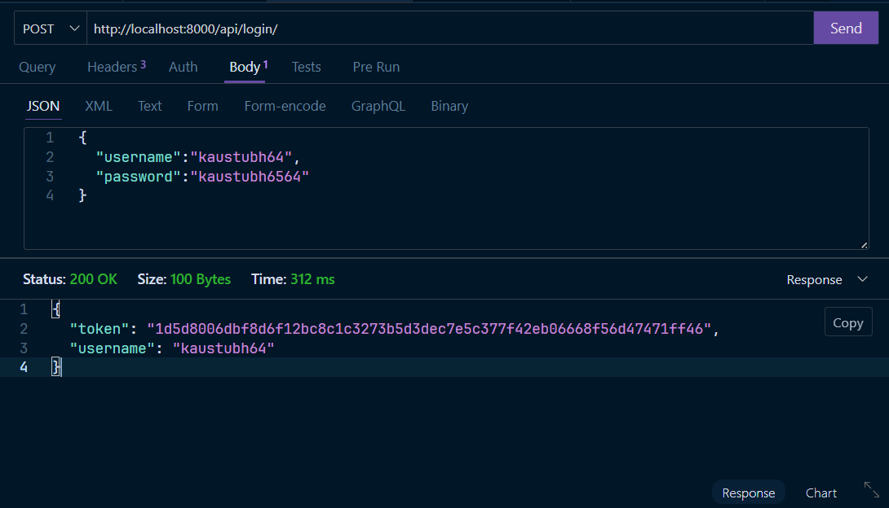

# AI Chat System – Django REST API

This project is a Django-based REST API for an AI chat system that integrates with **Google Gemini API** to generate intelligent chatbot responses.  

It supports:
- **User Registration**
- **Login & Token Authentication**
- **AI Chat**
- **Token Balance Tracking**

---

## 📌 Features
- **New User Tokens**: Users start with `4000` tokens.
- **Secure Authentication**: Token-based login using Django REST Framework.
- **AI Chat**: Powered by Google Gemini API.
- **Token Deduction**: 100 tokens per chat request.
- **Chat History**: All conversations are stored in the database.
- **Token Balance API**: Quickly check remaining tokens.

---

## 🛠 Installation Guide

### 1️⃣ Clone the repository
```bash
git clone https://github.com/yourusername/ai-chat-system.git
cd ai-chat-system
```

### 2️⃣ Create a virtual environment
```bash
python -m venv venv
source venv/bin/activate      # Mac/Linux
venv\Scripts\activate         # Windows
```

### 3️⃣ Install dependencies
```bash
pip install -r requirements.txt
```

### 4️⃣ Create `.env` file
Create a `.env` in the project root:
```
GEMINI_API_KEY=your_google_generative_ai_key_here
```

### 5️⃣ Apply database migrations
```bash
python manage.py makemigrations
python manage.py migrate
```

### 6️⃣ Run the server
```bash
python manage.py runserver
```

---

## 📡 API Endpoints

### 1. **Register User**
`POST /api/register/`  
**Request Body:**
```json
{
  "username": "john_doe",
  "password": "mypassword"
}
```
**Example Screenshot:**  


---

### 2. **Login**
`POST /api/login/`  
**Request Body:**
```json
{
  "username": "john_doe",
  "password": "mypassword"
}
```
**Response:**
```json
{
  "token": "your_token_here"
}
```
**Example Screenshot:**  


---

### 3. **Chat with AI**
`POST /api/chat/`  
**Headers:**
```
Authorization: Token your_token_here
Content-Type: application/json
```
**Request Body:**
```json
{
  "message": "Tell me a fun fact about space."
}
```
**Response:**
```json
{
  "message": "Tell me a fun fact about space.",
  "response": "Space is completely silent...",
  "tokens_remaining": 3900
}
```
**Example Screenshot:**  


---

### 4. **Check Token Balance**
`GET /api/tokens/`  
**Headers:**
```
Authorization: Token your_token_here
```
**Response:**
```json
{
  "tokens": 3800
}
```
**Example Screenshot:**  


---

## 📊 Input & Output Samples

**Register**
```bash
curl -X POST http://127.0.0.1:8000/api/register/   -H "Content-Type: application/json"   -d '{"username":"john","password":"pass123"}'
```
**Output:**
```json
{
  "message": "User registered successfully.",
  "username": "john",
  "tokens": 4000
}
```

---

## 🚀 Suggestions for Improvement
- **Async WebSockets for Better Experience** – Real-time, bidirectional chat using Django Channels.
- **Recent Chat Context Pipeline** – Send recent chat history to LLM for improved contextual understanding.
- **Message Caching** – Use Redis to avoid DB lookups on every request.
- **Token Update on Every Request** – Ensure tokens are updated in real-time with every message.
- **Streaming AI Responses** – Stream partial LLM responses for a smooth experience.
- **Multiple Model Support** – Let users pick the AI model they want.

---

## ✅ Challenges Encountered
I did not encounter any challenges during this implementation because I have developed an advanced version of this system before, which included additional features and optimizations.

---

## 📄 License
MIT License
